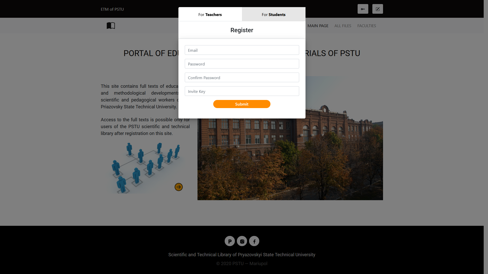
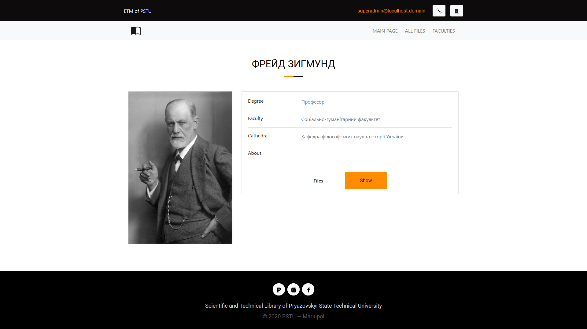

<p align="center"><a href="https://laravel.com" target="_blank"></a></p>

# cw-etm-portal

## About

This project is a very simple website that provides interaction with various educational and methodological manuals of university teachers.

## Installation and using

This project provides you a working laravel environment without requiring you to install PHP, a web server, and any other server software on your local machine. For this, it requires Docker, Docker Compose and Task.

1. Install [Docker](https://docs.docker.com/engine/installation/), [Docker-compose](https://docs.docker.com/compose/install/) and [Task](https://taskfile.dev/#/installation);

2. Clone this project and then cd to the project folder;

3. Run the initial build of the environment:
```
$ task init
```

4. Install all composer and npm dependencies:
```
$ task composer -- i
$ task npm -- i
```

5. Run the application using the command:
```
$ task up
```

6. Create your own .env file by copying .env.example:
```
$ cp src/.env.example src/.env
```

7. Generate the unique application key:
```
$ task artisan -- key:generate
```

8. Now create the database:
```
$ task artisan -- db:create
```

9. Then run migrations and seeds, which will create the necessary db data:
```
$ task artisan -- migrate
$ task artisan -- db:seed --class=PermissionsSeeder
$ task artisan -- db:seed --class=SuperAdminSeeder
```

10. Create a symlink for storing public data:
```
$ task artisan -- storage:link
```

11. You've done! Main page is available on http://localhost, phpMyAdmin - http://localhost:3309

12. After finishing work, you can stop running containers:
```
$ task down
```

## Screenshots

<details>
  <summary>Expand</summary>

  <p align="center">
    
    
    
    
    
    
    
    
    
    
    
  </p>
</details>

## Other

If necessary, you can independently use composer, artisan or npm with the following commands:
```
$ task composer -- ...
$ task artisan -- ...
$ task npm -- ...
```

## License

This project is licensed under the [GPL-3.0 License](LICENSE).

## Credits

My thanks to the developers of the [Docker](https://www.docker.com/company) and [Task](https://taskfile.dev/).

## Afterwords

I sincerely apologize for the monstrous naming of commits)
